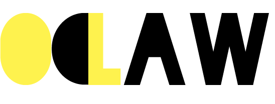
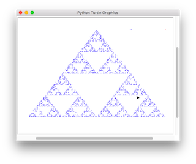

>“We have a strategic plan. It’s called doing things.” <cite>― Herb Kelleher ―</cite>

## [Digitizing the Long-EZ Plans](https://github.com/cobelu/Long-EZ)

Burt Rutan released the Long-EZ plans as open-source.
My goal is to fully digitize them for the 21st century.

## [Bully](https://github.com/cobelu/BuildLog)

Need to document an experimental aircraft build?
Tired of Kitlog, blogging sites, or even handwritten notes?
Me too!
Bully is a builder's logging tool, written in Java.

## [Odlaw](https://github.com/cobelu/Odlaw)

Odlaw was the final project for [CSCI2390](https://cs.brown.edu/courses/csci2390/), Privacy-Conscious Computer Systems.
The goal of the project was to help DBAs search for client data in order to quickly package and ship a GDPR-compliant user data report.
[You can read the final paper here](https://cs.brown.edu/courses/csci2390/assign/project/report/odlaw.pdf).

## [The Chaos Game]()

I learned about The Chaos Game while taking PHYS311 Classical Mechanics.
You could play the game by hand, but I'm a computer scientist, so I wrote a quick Python program to play it for me.
I like how the Turtle package it simulates the point-by-point nature of the game.

## [PRRC](https://github.com/cobelu/PRRC)

The Pi Rick-Roll Controller ("prick") came to fruition when I realized that somebody had written a Python package to interface with the Chromecast protocol.
It rick-rolls every Chromecast device on your connected network.
Use with caution!

## [Picard](https://github.com/cobelu/Picard)

The Picard (a portmanteau of Pi Aviation Conditions Indicator/nod to Star Trek) is a Pi-powered device to show aviation weather conditions on a series of LEDs.
Many thanks to Michael DuPont, whose REST API powers the project.
